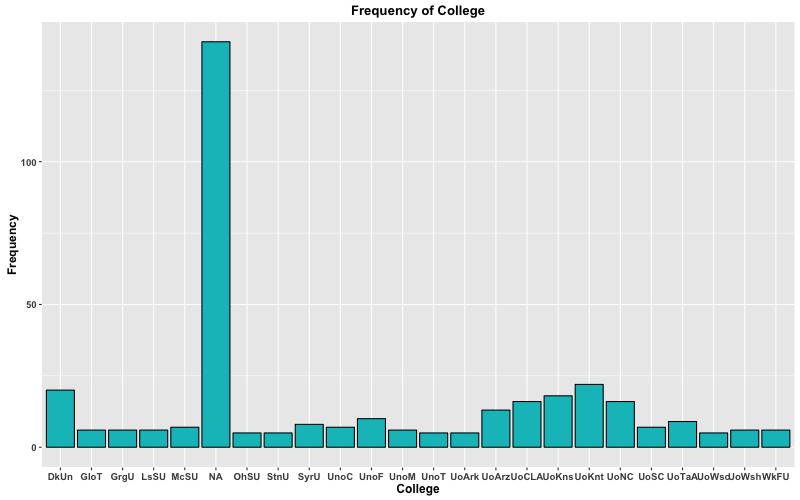

```{r setup, include=FALSE}
knitr::opts_chunk$set(echo = TRUE)

```

# Contents

1. [Abstract](#abstract)
2. [Introduction](#introduction)
3. [Data](#data)
4. [Methodology](#methodology)
5. [Results](#results)
6. [Conclusions](#conclusions)

# Abstract

The project involves analyzing data about basketball players from the NBA
League in the 2015-2016 season. The motivating question of the analysis is: “In
the 2015-2016 season, how do the skills of a player relate to his salary?” We
argue that regardless of their positions, most players earn a salary which is
directly correlated with their skill levels. We observe players’ skill levels
by calculating each player’s EFF index using his basic individual statistics
during the season: points, rebounds, assists, steals, clocks, turnovers, and
shot attempts. Principal Components Analysis (PCA) is used to assign weight for
each term in the original EFF formula. For the earned salaries during the
season, we reference the released data from Basketball Reference’s Salary
reports for individual players. (From analysis of EFF index and salary of
individual players, we indeed find that skill levels and salary have a direct
positive relationship among the players in the NBA League).

# Introduction

In any sports league, performance of a player during the season determines
his/her monetary value in the League and eventually determines his salary. In
this sense, it is important to understand how closely a player’s performance is
related to his salary. Analyzing this relationship provides an understanding of
how fairly and reasonably have the NBA teams have paid their players during the
2015-2016 season.

To measure each player’s performance during the season, we adopt in this paper,
the EFF or efficiency statistics, an index that is widely used to measure the
performance of NBA players. EFF is derived by a simple formula:
`EFF = (TP + TR + A + S + B – MFG – MFT – T) / GP`, where TP = total points,
TR = total rebounds, A = assists, S = steals, b = blocks, MFG = missed field
goals, MFT = missed free throws, T = turnovers, and GP = games played.

However, one of the issues with the EFF index is that it favors offense
oriented players over defense oriented players, as defense players have less
chance to score a goal, or catch a rebound compared to the offensive players.
To compensate for this drawback, we use a modified EFF that consider the
player’s positions. We utilize Principal Components Analysis (PCA) giving
weight for each term in the original EFF formula. 

The modified efficiency, EFF\*, is computed as:
`EFF* = (w1/s1)*x1 + … + (w8/s8)*x8`


We predict that this modified efficiency, EFF\* has a direct positive
relationship with the salary that a player receives during the season. The
remainder of the paper is organized as follows. In [Data](#data) we briefly
discuss the data table, its structure, and each variable’s significance. In
[Methodology](#methodology) we describe how we obtained and cleaned our data
to fit our purpose of study and illustrates how we computed the modified
EFF\*. [Results](#results) investigates the relationship between performance
and salary from the perspective of the computed EFF\*. Finally, in
[Conclusions](#conclusions) we summarize our findings and point out any
outstanding trends.

# Data

The National Basketball Association (NBA) is the pre-eminent men's professional
basketball league in North America, and is the premier men's professional
basketball league in the world. It has 30 teams (29 in the United States and 1
in Canada).
[citation](https://en.wikipedia.org/wiki/National_Basketball_Association)

Basketball Reference.com provides professional basketball statistics updated
daily for every season. The site also includes sections for coaches, awards,
leaders, and the playoffs. It is one of the sites that is under Sports
Reference that provide both basic and sabermetric statistics and resources for
sports fans everywhere. 

From the raw data files of NBA players played in 2015-2016 season provided by 
Basket Reference, we have created a single csv file, “roster-salary-stats.csv”,
containing all variables from Roster, Totals, and Salary, with only one column
for the name of the player (the methodology of data acquisition and cleaning
will be discussed in the section that follows).

In the csv file, the table contains the following variables:
Player, Team, Number, Position, Height, Weight, Birth Date, Country,
Experience, College, Rank Totals (within the team), Age, Games, Games Started,
Minutes Played, Field Goals, Field Goal Attempts, Field Goal Percentage,
3-Point Field Goals, 3 Point Field Goal Attempts, 3 Point Field Goal
Percentage, 2 Point Field Goals, 2 Point Field Goal Attempts, 2 Point Field
Goal Percentage, Effective Field Goal Percentage, Free Throws, Free Throw
Attempts, Free Throw Percentage, Offensive Rebounds, Defensive Rebounds, Total
Rebounds, Assists, Steals, Blocks, Turnovers, Personal Fouls, Points, Points,
Rank Salary (within the team), and Salary.

The data table combines three distinct data tables (roster, totals, and
salary) and is sorted by the player names. As the purpose of our study is to
investigate the relationship between performance and salary, the variables
that derive performance index and salary are critical. Among the variables
acquired from totals table, the critical variables to compute EFF index (the
performance index) are Total Points, Total Rebounds, Assists, Steals, Blocks,
Field Goals, Field Goal Attempts, Free Throws, Free Throw Attempts, Games
(total # of games).  Also, the players’ positions, obtained from the roster
table, are also critical in that we later subset the player statistics dataset
by positions to calculate separate EFF indices for each position. Needless to
say, salary is the most important variable in our study. 

All data tables created in this project are in csv format, while data summary
files are in txt format. 

# Methodology

## Data Acquisition

We obtained our data through webscraping in two phases. First, we accessed the
page with all team names and extracted the team abbreviations using the XPath
of the desired rows. Then, using the team abbreviations, we concatenated the
URL's to access and we did the following for each page:

1. Find the line containing the table ID we want (e.g. 'id="roster"').
2. Iterate through the lines following the previously found line until the
"</table>" closing tag is found.
3. Parse the table found between those two bounds (inclusive) into a data.frame
to be exported to a CSV file.
4. Repeat for other 2 tables we desire.

In this way, we were able to obtain all of our raw data to be processed by our
cleaning script.

## Data Cleaning 

After acquiring the data from Basketball References, we have cleaned three
distinct data tables according to the following schema: 
* Roster table: contains basic information about players for each team (e.g
height, birth date, college,etc). We attempted to clean data in which each
element in the same 
column obtains the same standard unit or expression. For example, in  the 
Experience column, "R" means 0 years experience, so we converted R to 0 so 
that the Experience column contains integers only. The same procedure is applied 
for the 
rest. In details, Player and College columns are kept as character. Country is
abbreviated in upper case, Height is in feet and Weight is in lbs. Birth Date
is in the `YYYY-MM-DD` format and all empty cells are considered as NA.  
* Stats table: contains all statistical performance data for each player. All
of the columns are numeric except for Player which is character. Again, empty
cells are filled with NA. 
* Salary table: contains the salary for each player. We converted the salary
columns from `$00000` to `000000`. 

After cleaning each table, we then merged the three distinct data tables-
roster, totals, salary- of each team and merge them using `merge()` which also
sorted them by the player names. We repeated this process for all teams and
combined all teams’ data using `rbind()`.
There were some players who appeared in multiple teams’ tables. For these
players, we have used “duplicated()” function to only acquire the data from
one team.  
Data cleaning produces a big data frame, called `roster-salary-stats.csv` which
contains roster, stats, salary information for all teams.

## EDA

### Text Data Values (Sink'ed to file) 

For the aggregated dataset, we partitioned the columns into 2 groups:

1. Qualitative data, e.g. Position
2. Quantitative data, e.g. Steals

For the qualitative data, we used dplyr to determine the frequency of each
value and printed the resulting 2 column data.frame to `eda-output.txt`.

For the quantitative data, we used R's built-in `summary()` function to
generate most of the summary statistics. To get range, we simply subtract
`Min.` from `Max.` in the return value from `summary()` and added it to the
same result. This was then printed to the same output file, `eda-output.txt`.

### Histogram, Bar Charts, and Boxplot 

After calculating descriptive summaries for quantitative variables (e.g. mean,
median, min, max, std dev, range, etc) and frequencies for qualitative
variables, we present the results by making histograms and boxplots for
quantitative variables and bar charts for qualitative variables. For all the
plots, the x-axis displays the variable (e.g college, experience, etc) and
the y-axis displays the frequency of each variable. NA is also considered as
one of the possibilities. For example, the bar chart for College includes NA
as a school, since NA may give some information as to whether the players were
recruited by the collges or otherwise. 

## Data Analysis

From the cleaned “roster-salary-stats.csv” file, first subset the data
according to the player’s position. Then add the following columns: Missed
Free Throws (`Free Throws - Free Throws Attempts`), Missed Field Goals
(`Field Goals – Field Goal Attempts`) and negate the number of turnovers to
match our EFF formula:
`EFF = (total points + total rebounds + assists + steals + blocks – missed
field goals – missed free throws – turnovers) / (games played)`. 
From the subset of data table, select variables that are needed to compute
EFF. Then, eliminate the compounding variable, “number of games played” by
dividing each variable by the “number of games played”. Using `prcomp()`,
compute PCA1 for each subset. Divide these weights with standard deviation of
each variable, re-expressing the weights. Multiply these adjusted weights with
each variable (now divided by the number of games). Sum these together to
obtain EFF\*.  

## ShinyApp

In order to better visualize and understand the data, we built two shiny apps.
The first, titled "Salary Statistics by Team", displays a horizontal boxplot
that compares the different NBA Teams' salaries. The second, titled "Statistic
Comparison for Players", presents a scatterplot comparing a range of variables
for individual players and displays the variables correlation. These apps
serve as an approachable way to further analyze the data, the results of which
will be discussed further in the rest of the report.

# Results

As anticipated, EFF and salary are positively correlated (r = 0.474). This
result is reasonable since managers of each team will likely be paying players
based on their overall skill levels. However, there are several factors that
weaken the correlation.


First, the salary of each player is determined at the beginning of the season.
Even though a player may perform well for several years, 2015-2016 may be one
of his worse years. In other words, because change in salary doesn't
immediately follow the change in performance, the correlation between EFF and
salary is weakened. Second, salary of a player rarely goes down within a team.
Therefore, players who are part of the same team for a long period of time
will be paid well compared to many rookies in the team regardless of his
performance during the 2015-2016 season.

Another source of compounding is player's choice. Even if a player's
performance is better than other players who are paid more, a player might
choose a team paying a little less because of preference. In other words, it
is not only the financial incentives that players consider when choosing a
team.  

Also, in reality, the managers not only look at player's data while drafting.
They watch how each player play in the game and look at things that cannot be
recorded as a data.

In addition, salary is a relative measure not an absolute measure. Said
another way, there is no set monetary value per steal or per point. Rather,
managers usually evaluate players based on the overall data (and sometimes
intuitions) and offer a somewhat arbitrarily rounded dollar amount. We say
"relative" because salary is often determined in comparison to other players
in the team or in the league.  

There were some interesting results regarding the correlation between several
other variables.

First, experience showed relatively weak correlation with EFF (r = 0.209) 
which demonstrated that the years a player played in NBA cannot be used to
predict his skill level. 


We suspect there are two major trends that are
happening together. First, as the weak positive correlation shows, more
experience in the League generally helps a player to perform better. This can
be because players get used to the atmosphere and and the pressure while
playing in the premiere League. However, some rookie players may perform
better than the continuing players as they feel obligateded to stand out.
While rookie players think playing of the NBA as a great opportunity that they
do not want to let go, original players may be more relaxed with their
results. We suspect this trend dampens the positive correlation between the
experience and EFF.

It was also interesting to see how EFF is weakly correlated with points while
strongly correlated with steals (r = 0.605) and defensive rebounds (r = 0.698,
r = 0.706). 


This has to do with the positions that players play. While point
guards many opportunities to score points, other positions have relatively
fewer chances to do so. As the correlation measure takes all positions into
account, points have a relatively small correlation with the efficiency level.
Meanwhile, steals and rebounds are moves that all players perform. Therefore,
this is likely why it is strongly correlated with the EFF.

There were several notable results from EDA. Among these results, a large
proportion of players did not have data for college. While it is possible that
Basketball Reference left out the data, this is highly unlikely as all other
variables rarely had a missing data. Basketball Reference also includes school
information as long as a player has ever been matriculated as it can be
observed from Jeremy Lin's example where his school information shows Harvard
University even after his graduation. Therefore, we observe that many NBA
players did not go to college from the beginning.



# Conclusions
The project shows that while there is a positive correlation between eff and 
salaries, it is only moderate. This data along with many other correlation 
coefficients can be valuable to many people in the basketball industry. Among 
them, managers of each NBA team will benefit the most as they are in charge of 
drafting new players and determining salaries of both rookie and continuing players. 
This moderate result brings us to think there must be some other factor that managers 
of each team consider when determining a player's salary. While the extent may be 
different from position to position, we hypothesize, that in general, the salary 
is highly correlated with the number of wins that players bring in to the team. 

In the future, we would like to plot data for each postion and let Shinyapp 
compute correlation coefficient of two variables for each of the position. 
By comparing r value for each position, the data would be more helpful to 
the managers as it will help them setting standards for each position while drafting. 
Also, in order to test our hypothesis, we are interested in the correlation 
between the number of wins and salary. While individual performance level 
matters, basketball is about the team. If a player brings more wins regardless 
of his recorded performance, there is something about the player that brings 
success to the game. If possible, it would be also interesting to participate 
in the data collection process. While the current measure of performances are 
somewhat valid, we feel there are more measures that can we can incorporate in 
the calculation of eff to make it a more reliable and valid measure that ties 
closely with the number of wins that a player brings to a team. If the eff can 
predict the number of wins that a player can bring, managers will have easier 
time evaluating players' value and assign salaries' accordingly.
